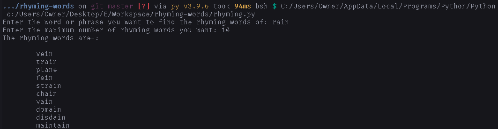

# How to use

1. Install [python](https://python.org/downloads).
2. Download [`rhyming.py`](https://raw.githubusercontent.com/DhruvMitna/rhyming-words/master/rhyming.py).
3. Open the downloads folder and open `rhyming.py`.

### An example

